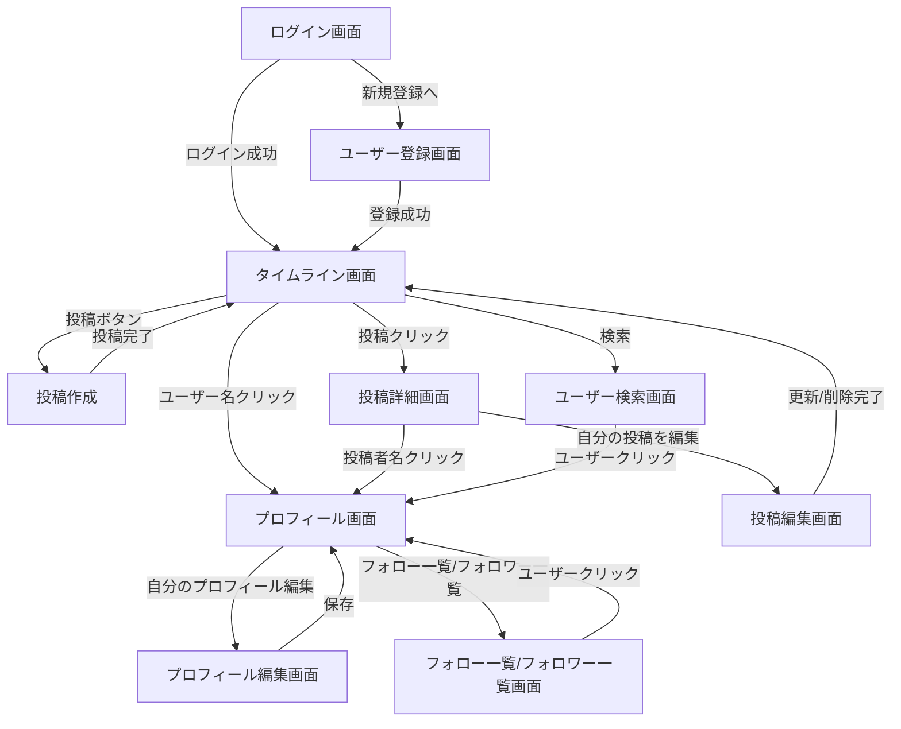

# RaiseTechタイムライン 画面設計(画面一覧・遷移図)

[要件定義書](./requirements.md)の機能一覧に対応する画面一覧と遷移図。レイアウトの詳細(コンポーネント構成・スタイル等)は実装フェーズで別途検討する。

## 1. 画面一覧

| 画面名 | 目的 | 主な要素 |
|---|---|---|
| ログイン画面 | 既存ユーザーの認証 | メールアドレス/パスワード入力、ログインボタン、新規登録画面へのリンク |
| ユーザー登録画面 | 新規アカウント作成 | ユーザー名・メールアドレス・パスワード入力、登録ボタン |
| タイムライン画面 | 投稿の閲覧起点(ホーム) | 全体/フォロー中タブ、投稿一覧、投稿作成の入口 |
| 投稿作成 | 新規投稿の作成 | 本文入力(280文字カウンタ)、画像添付、投稿ボタン(モーダル想定) |
| 投稿詳細画面 | 1投稿の詳細とコメント閲覧・投稿 | 投稿本文・画像、いいね、コメント一覧、コメント入力欄 |
| 投稿編集画面 | 自分の投稿の編集 | 本文編集、更新ボタン、削除ボタン |
| プロフィール画面 | ユーザーの投稿一覧とプロフィール情報 | アイコン・表示名・自己紹介、フォロー/フォロー解除ボタン(他人の場合)、そのユーザーの投稿一覧 |
| プロフィール編集画面 | 自分のプロフィール編集 | 表示名・自己紹介・アイコン変更 |
| フォロー一覧 / フォロワー一覧画面 | 特定ユーザーのフォロー・フォロワー関係を閲覧 | ユーザーリスト(各行からプロフィール画面へ遷移) |
| ユーザー検索画面 | ユーザー名・表示名によるユーザー検索 | 検索入力欄、検索結果一覧 |

## 2. 画面遷移図

## 3. 補足

- 投稿作成はタイムライン画面上のモーダル表示を想定しているが、実装フェーズで専用画面に分けるかは再検討可能。
- ナビゲーション(ヘッダー/サイドバー等)の具体構成は本ドキュメントでは定義せず、実装フェーズのUI設計で決定する。
